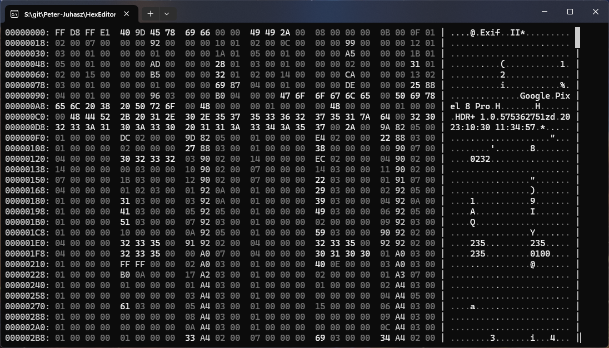
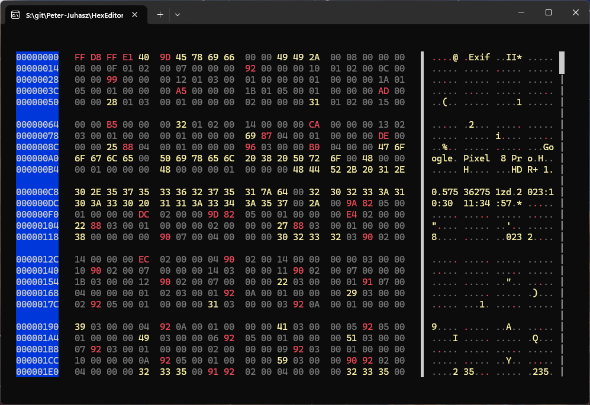

# HexEditor

A fast and efficient hex viewer, built with .NET.



## CLI

- **Peak** into binary files with ease or **Interactive** viewer
- **Virtualization**: open **arbitrary large files** files, it loads only parts of the file into memory that are visible on screen
- Rich **theming** support for a customizable look

### Usage

Peak into a file:

```sh
```sh
hex <path>
```

Use interactive mode:

```sh
hex <path> --interactive
```

Navigation in interactive mode:

- `PageUp`/`PageDown`: Scroll by one page up/down
- `Ctrl` + `Up`/`Down`: Scroll by one line up/down
- `Ctrl` + `Home`/`End`: Go to the beginning/end of the file

### Theming

You can create custom themes in JSON files following the structure of [ConsoleTheme](src/HexEditor.Cli/ConsoleTheme.cs):



### Build

Prerequisites:
- .NET 10 SDK or later

The `HexEditor.Cli` project can be built using standard .NET tools:

```sh
dotnet build
```
